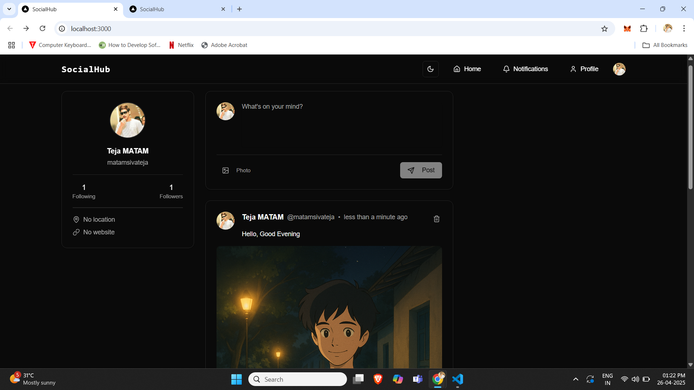

# ✨ Social Media Platform

Experience a social networking platform where users can share moments, connect with friends, and engage in meaningful interactions. Built with cutting-edge technologies like Next.js 13+ and TypeScript, offering real-time updates, seamless media sharing, and a responsive user experience.



## ✨ Core Features

### 🤝 Social Networking
- **User Profiles** - Customizable profiles with bio and avatar
- **Follow System** - Connect with other users
- **Activity Feed** - Personalized feed from followed users
- **Real-time Notifications** - Stay updated with social interactions

### 📱 Content Sharing
- **Posts** - Share thoughts and updates
- **Image Uploads** - Share images in posts
- **Comments** - Engage in discussions
- **Likes** - Express appreciation for content

### 🛡️ Technical Features
- **Secure Authentication** - Powered by Clerk
- **Real-time Updates** - Instant feedback and notifications
- **Responsive Design** - Mobile-first approach
- **Type Safety** - Built with TypeScript
- **Data Persistence** - PostgreSQL with Prisma ORM

## 🔧 Tech Stack

### Frontend
- **Next.js 13+** - React framework with App Router
- **TypeScript** - Type-safe development
- **Tailwind CSS** - Utility-first styling
- **Shadcn/ui** - Modern UI components

### Backend
- **PostgreSQL** - Reliable database
- **Prisma** - Type-safe ORM
- **Clerk** - Authentication service
- **UploadThing** - File upload solution

## 🚀 Getting Started

### Prerequisites
- Node.js 18+ installed
- PostgreSQL database
- Clerk account
- UploadThing account

### Installation

1. Clone the repository:
```bash
git clone https://github.com/yourusername/social-media-app.git
cd social-media-app
```

2. Install dependencies:
```bash
npm install
```

3. Configure environment variables:
```bash
# Create .env file in root directory
NEXT_PUBLIC_CLERK_PUBLISHABLE_KEY=your_clerk_pub_key
CLERK_SECRET_KEY=your_clerk_secret
DATABASE_URL=your_postgres_url
UPLOADTHING_TOKEN=your_uploadthing_token
```

4. Set up the database:
```bash
npx prisma generate
npx prisma db push
```

### Development

Start development server:
```bash
npm run dev
```

Build for production:
```bash
npm run build
npm start
```

## 🔍 Key Implementation Features

### Frontend
- Server and Client Components
- Dynamic and static routes
- Loading and error states
- Optimistic updates
- Responsive layouts

### Backend
- Route handlers
- Server actions
- Data caching
- Real-time notifications
- Secure file uploads

## 📖 Documentation

For detailed documentation, see:
- [Next.js Documentation](https://nextjs.org/docs)
- [Prisma Documentation](https://www.prisma.io/docs)
- [Clerk Documentation](https://clerk.dev/docs)


